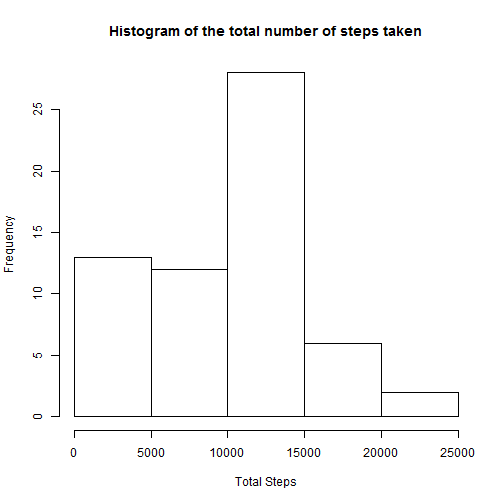
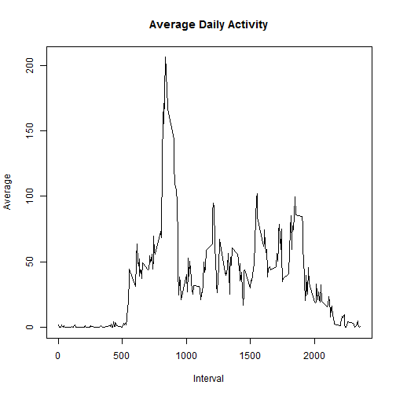
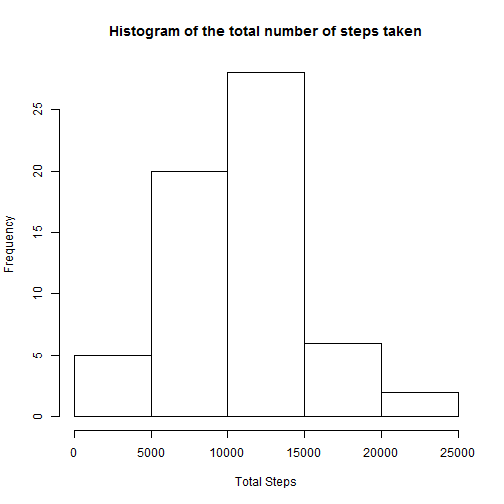
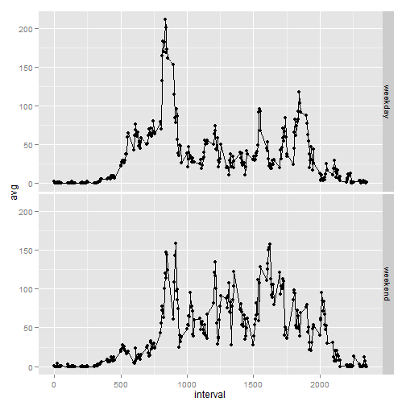

Reproducible Research Peer Assignment 1
========================================================

## Loading and preprocessing the data
We will be using plyr and ggplot2 libraries.


```r
library(plyr)
library(ggplot2)
```

We now read into the file 'activity.csv' into a variable called 'data'.


```r
data <- read.csv("activity.csv",header=TRUE)
```

## What is mean total number of steps taken per day?

### Make a histogram of the total number of steps taken each day.

First we summarise the data using ddply (we split it by date) and find the total steps taken for each day.
We then make a histogram of the data.

```r
total <- ddply(data,"date",summarise,total.count=sum(steps,na.rm=TRUE))
hist(total$total.count,main="Histogram of the total number of steps taken",xlab="Total Steps")
```

 

### Calculate and report the mean and median total number of steps taken per day

```r
mean(total$total.count,na.rm=TRUE)
```

```
## [1] 9354
```

```r
median(total$total.count,na.rm=TRUE)
```

```
## [1] 10395
```


## What is the average daily activity pattern?

### Make a time series plot (i.e. type = "l") of the 5-minute interval (x-axis) and the average number of steps taken, averaged across all days (y-axis)
We now summarise the data using ddply (we split it by 'interval') and find the average number of steps taken per 5-minute interval.

```r
dailyactivity <- ddply(data,"interval",summarise,mean.count=mean(steps,na.rm=TRUE))

plot(dailyactivity$interval,dailyactivity$mean.count,type="l",main="Average Daily Activity",xlab="Interval",ylab="Average")
```

 

### Which 5-minute interval, on average across all the days in the dataset, contains # the maximum number of steps?
We use which.max to find the index of the required interval.

```r
dailactivity[which.max(dailyactivity$mean.count),1]
```

```
## Error: object 'dailactivity' not found
```

## Inputing missing values

### Calculate and report the total number of missing values in the dataset (i.e. the total number of rows with NAs)

```r
count(is.na(data$steps))[2,2]
```

```
## [1] 2304
```

### Devise a strategy for filling in all of the missing values in the dataset.
We will replace the missing values in an interval by the mean of that 5-minute interval.
We first make a copy of the original data which will be used for further calculations.

The loop goes through all the 'step' values of the data.
If a value is NA it is replaced by the average of that specific interval (which is found from the 'dailyactivity' variable).

```r
copy=data
for (i in 1:nrow(copy)){
  if (is.na(copy[i,1])){
    row= (copy[i,3]+5)/5
    copy[i,1]=dailyactivity[row,2]
  }
}
```

### Make a histogram of the total number of steps taken each day and Calculate and report the mean and median total number of steps taken per day.


```r
copytotal <- ddply(copy,"date",summarise,copytotal.count=sum(steps,na.rm=TRUE))
hist(copytotal$copytotal.count,main="Histogram of the total number of steps taken",xlab="Total Steps")
```

 

```r
mean(copytotal$copytotal.count,na.rm=TRUE)
```

```
## [1] 10282
```

```r
median(copytotal$copytotal.count,na.rm=TRUE)
```

```
## [1] 10395
```
What is the impact of imputing missing data on the estimates of the total daily number of steps?

The mean has increased because we have added it multiple times to the dataset.
The median stays constant because the mean is the middle value. So, it won't change the median.

## Are there differences in activity patterns between weekdays and weekends?

### Create a new factor variable in the dataset with two levels - "weekday" and "weekend" indicating whether a given date is a weekday or weekend day.
We first convert the 'date' column to a 'Date' type by using as.Date.
We then create a new variable with 2 levels 'weekday' and 'weekend' using if-else conditions.

```r
copy$date <- as.Date(copy$date)
copy$weektime <- as.factor(ifelse(weekdays(copy$date) %in% c("Saturday","Sunday"),"weekend", "weekday"))
```

### Make a panel plot containing a time series plot (i.e. type = "l") of the 5-minute interval (x-axis) and the average number of steps taken, averaged across all weekday days or weekend days (y-axis).
We first transform the new dataset using ddply (we split it by both interval and weektime) and find the average values.
We then plot the dataset using qplot.

```r
avg <- ddply(copy,.(interval,weektime),summarise,avg=mean(steps,na.rm=TRUE))
qplot(interval,y=avg,data=avg,facets=weektime~.)+geom_line()
```

 
